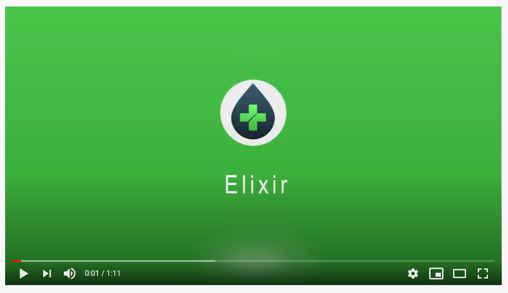
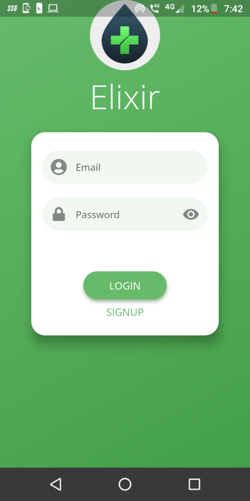
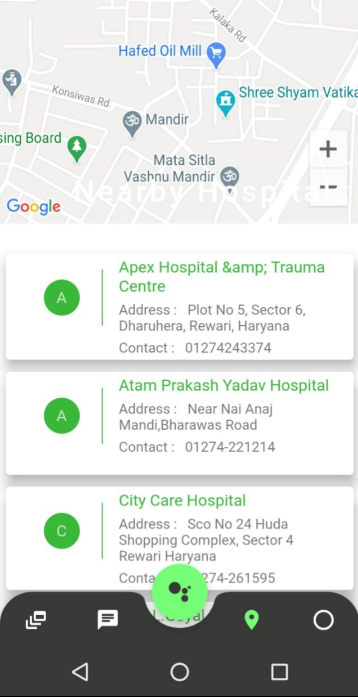
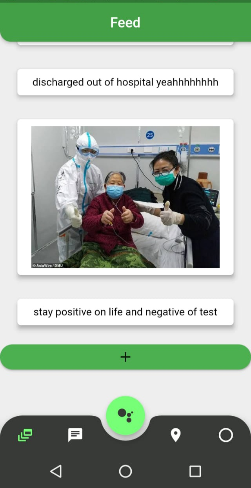
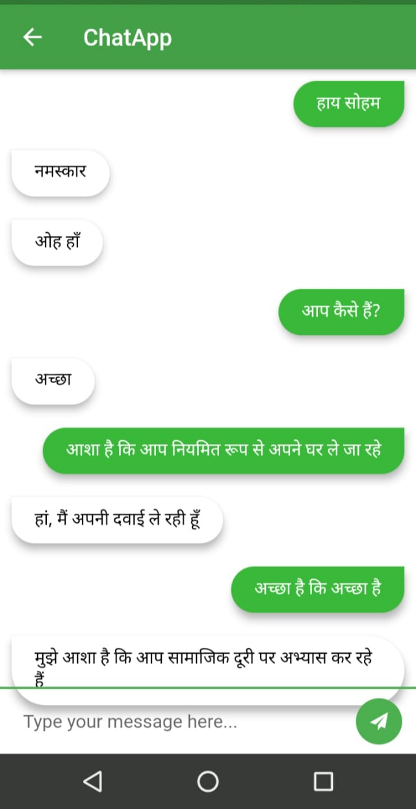
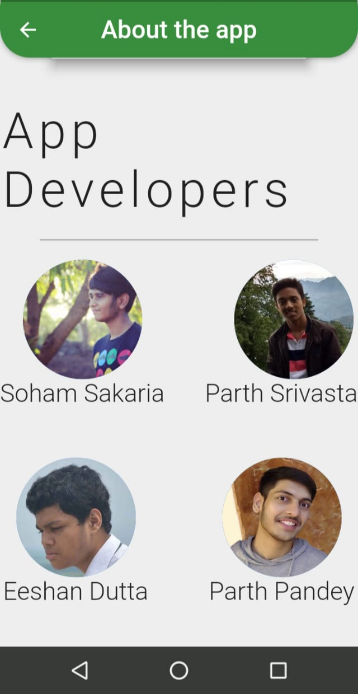

# Elixer

**(Click the image to go to the youtube video link of the App)**

**FLUTTER MOBILE APP APK -** [[click here]](https://github.com/savss624/Elixir/raw/main/Elixir.apk)

With the rise of people getting affected with Covid-19 we were looking at data on the level of healthcare people all around India was receiving and one of the things we found that people in rural areas are clueless about the symptoms of the disease and also lack proper medical supervision/care. 

Hence , the team Ctrl Alt Elite came up with the idea of providing the people all over India an application that will not only connect the those in need with the correct medical care/supervision but also enable them to understand the implications of different diseases in a very intuitive way.

Introducing **Elixir**

a one stop location to discuss about different medical milestones , connect with different doctors worldwide with one on one encrypted chat and also video call them and also send them presciption via image upload from gallery or click picture from the app to forward images, AI chatbot that can have a conversation with you through both text and speech about different medical terms , locate nearby hospitals to get proper medical care , a feed/blog space to share their recovery stories and finally a translator to get the whole app in the language one is comfortable with and hence dissolve any communication barrier. This solution with shorten the gap between the people around the world in search for good healthcare and pave their a path in the journey of recovery.

## Features

1. Easy Sign up and Login with your email and password - powered by **Google Realtime Firebase**.

 

2. Takes Ur present location and searches and gives u a list of all nearby hospitals
  
3. Have one on one encrypted chat system for communication
  
4. Have a feed section for people to share recovery stories and give motivation to everyone
  
5. Video calling feature available in one on one chat
 
6. Common discussion forum available 
 
7. AI chatbot that speaks to you when u ask them basic questions about medical terms and general info
  
8. Language translation

      
      
      

**Developers :-**

 

We have made this Application with the vision of helping the community in any small way possible and just hope that the people suffering worldwide gets cured soon and lead a healthy life.
   
   Regards,
   
   **Team Ctrl-Alt-Elite**
